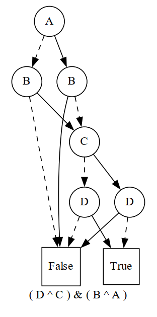
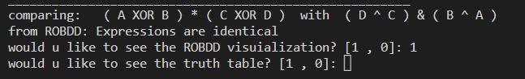

# ROBBD Checker

The purpose of this project is to create a ROBDD constructor. It has
various features such as visualization and comparisons between different
techniques such as Truth table or ROBDD comparison.

## Pre-requisites

In order to be able to use this program you first need to do the
following:

1.  Install Graphviz library ( pip install graphviz)

2.  Visit <https://graphviz.org/download/> and download the version
    suitable for your machine

    -   Note: on installation, you must tick "add to PATH" check box in
        order for it to work.

## Usage

You can create ROBDD objects and construct them using " construct()
"method by passing any Boolean expression in similar formats as follows

You can visualize the graph as follows

## output

you can use g.render(filename,
file_path,auto_view) to customize file output

you can also use compare_expressions(exp1,exp2) to
visualize and compare 2 different expressions

